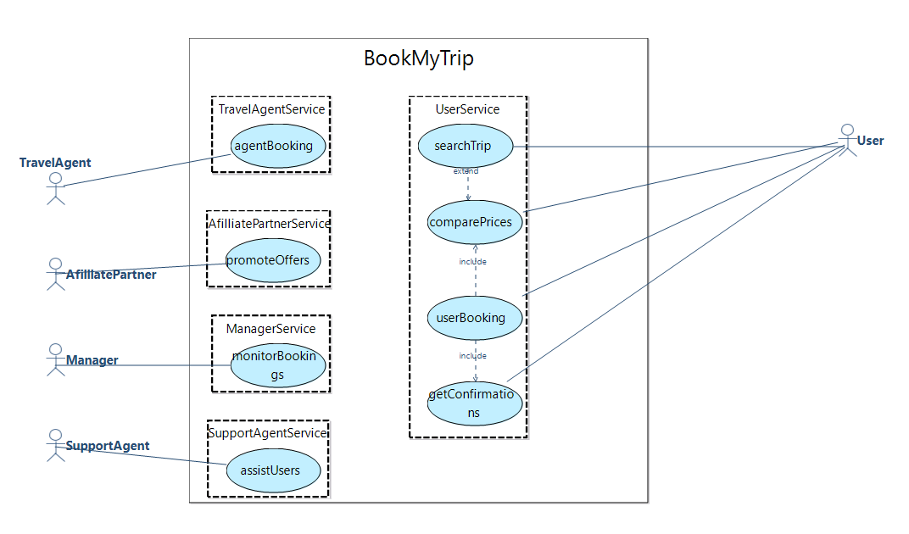
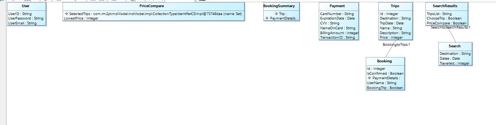
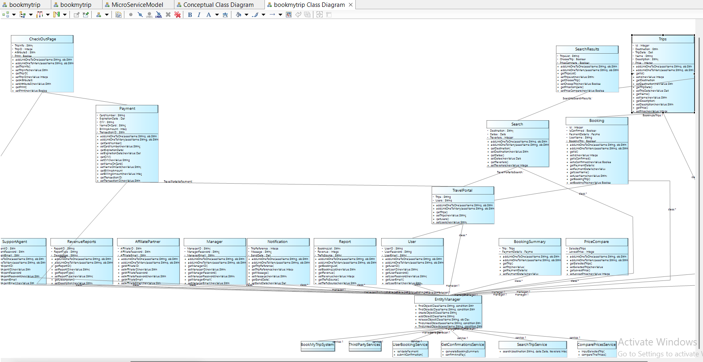

# 📖 BookMyTrip

A lightweight prototype of an online travel portal—search for trips, compare prices, book & pay, and retrieve confirmations—all under clean service contracts with automatic pre- and post-condition checks.

---

## 🚀 Table of Contents

1. [Use-Case Diagram](#1-use-case-diagram)  
2. [User Stories](#2-user-stories)  
3. [Domain Model](#3-domain-model)  
4. [Sequence Diagrams](#4-sequence-diagrams)  
5. [Service Contracts (OCL)](#5-service-contracts-ocl)  
6. [Validation](#6-validation)  

---

## 🌐 1. Use-Case Diagram


**Actors & Use-Cases**  
- **User**: `searchTrip`, `comparePrices`, `userBooking`, `getConfirmations`  
- **TravelAgent**, **AffiliatePartner**, **Manager**, **SupportAgent** each have their own specialized UCs  

---

## ✏️ 2. User Stories

  


**Examples**  
> **As a user**, I want to search for available trips so I can explore travel options.  
> **As an affiliate partner**, I want to promote offers and track referrals.  
> **As a system**, I want to integrate payment gateways, ensure uptime, and recover from failures.

---

## 📊 3. Domain Model


**Key Entities**  
- **User**, **TravelPortal**, **Trips**, **Booking**, **Payment**, **PriceCompare**, **BookingSummary**, ...  
- Rich associations & inheritance (e.g. `TravelPortal → Payment`, `Booking → Trips`)

---

## 🎞 4. Sequence Diagrams

1. **Search Trip**  
   

2. **Compare Prices**  
   

3. **User Booking**  
   

---

## 📐 5. Service Contracts (OCL)

### a) `SearchTripService::search(...)`

```ocl
Contract SearchTripService::search(
    destination:String,
    date:Date,
    travelers:Integer
) : Set(Trips) {
  definition:
    selectedTrips:Set(Trips) =
      Trips.allInstance()
           ->select(t | t.Destination = destination
                     and t.TripDate = date)
  precondition:
    destination <> "" and
    date <> null      and
    travelers > 0
  postcondition:
    result = selectedTrips
}

``` 
---


## 🛡️ 6. Validation

1. **Initial State**  
     
   At startup, all input fields are empty, no trips are listed, and the precondition panel shows green (`true`), since by default `destination <> "" and date <> null and travelers > 0` isn’t yet evaluated.

2. **Valid Input**  
     
   When you enter a non-empty destination, a valid date, and a positive traveler count, the search operation runs successfully: the precondition and postcondition panels stay green and the matching trips (if any) would appear in the table.

3. **Invalid Input**  
     
   If any input fails the precondition (e.g. empty destination), the precondition panel turns red and a warning dialog pops up (“Precondition is not satisfied”), preventing the operation from executing.

## 🏗️ Microservice Architecture

### 1. Microservice Use-Case Layout  
This high-level view shows each bounded context (dashed box) and which use-cases (ovals) belong in it.



---

### 2. Grouped Entities per Service  
Here we’ve laid out each domain/entity class inside its proper microservice context:

- **UserService**: `User`, `Trips`, `Booking`, `PriceCompare`, `Search`, `SearchResults`  
- **TravelAgentService**: `Report`, `Manager`  
- **AffiliatePartnerService**: `CheckOutPage`, `BookingSummary`, `SearchResults`  
- **ManagerService**: `AffiliatePartner`, `Notification`, `RevenueReports`  
- **SupportAgentService**: `SupportAgent`, `Payment`, `TravelPortal`


---

### 3. Conceptual Class Diagram  
The original conceptual/domain model that you used as the blueprint:



---

### 4. Auto-Generated Architecture (RapidMS)  
RapidMS can auto-generate this skeleton for you, tracing use-case operations into service interfaces:


---

### 🔄 7.2 Automated Generation of OO Detailed Design (RM2DM)

The diagram below was generated directly from our `bookmytrip.req` model using the RM2DM plugin. It illustrates:

- **Domain Entities** with full attribute lists and accessor/mutator operations (e.g. `User`, `Trips`, `Booking`, `Search`, `Payment`, etc.).  
- **Service Interfaces** at the bottom – one for each use-case/service contract:
  - `UserBookingService` (`confirmBooking(...)`, `validatePayment()`, `submitConfirmation()`)
  - `GetConfirmationsService` (`generateBookingSummary()`, `confirmAndPay()`)
  - `SearchTripService` (`search(destination, date, travelers): Set<Trips>`)
  - `ComparePricesService` (`inputSelectedTrip()`, `compareThePrices()`)
  - Plus core stubs: `BookMyTripSystem` and `ThirdPartyServices`.  
- A central **`EntityManager`** class auto-generated to handle common CRUD and query operations across all entities.  
- **Associations** and **multiplicities** derived from the domain model (e.g. `Booking → Trips`, `PriceCompare → Trips`, `TravelPortal → Payment`, etc.).



