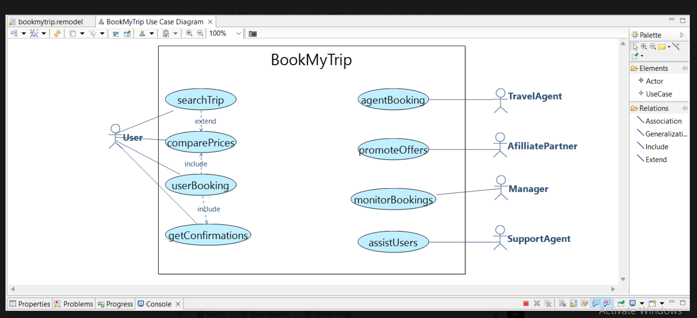
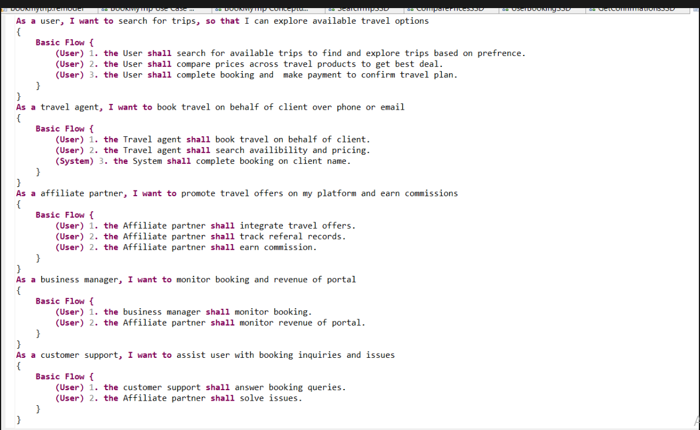
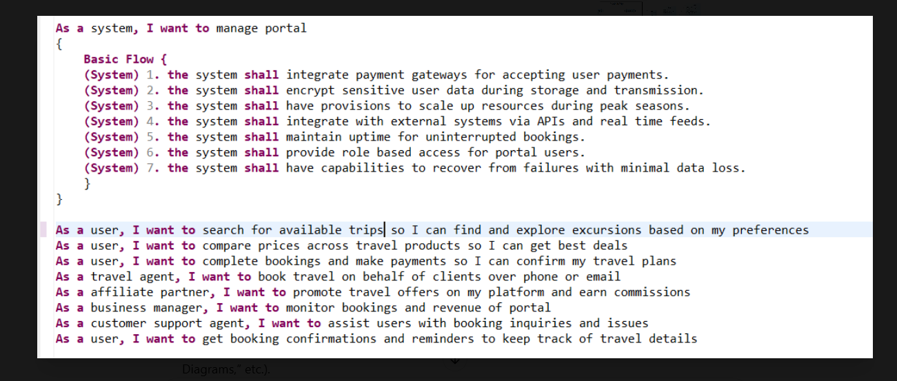
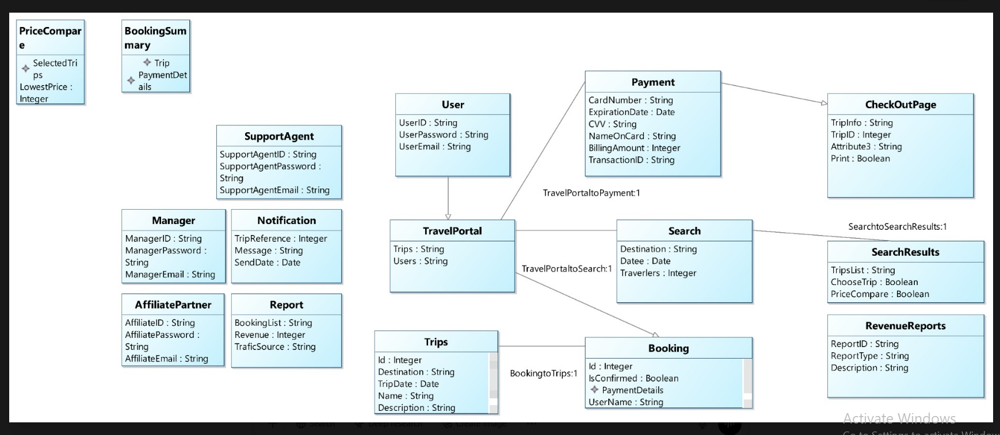
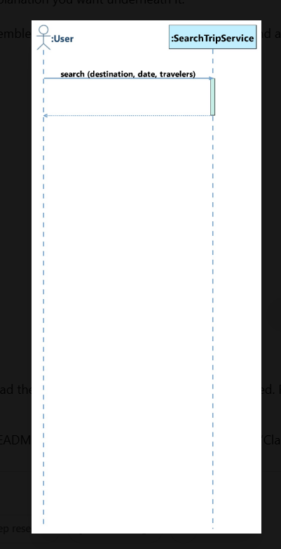
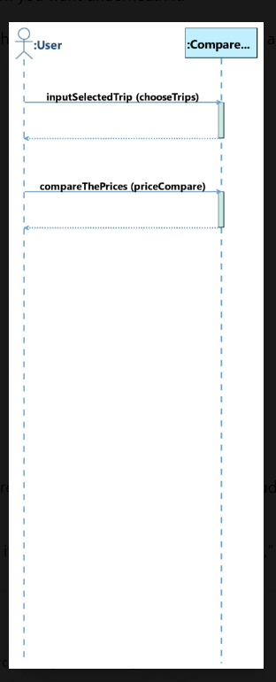
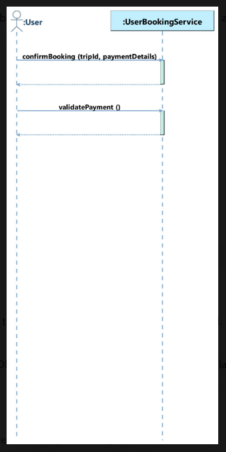
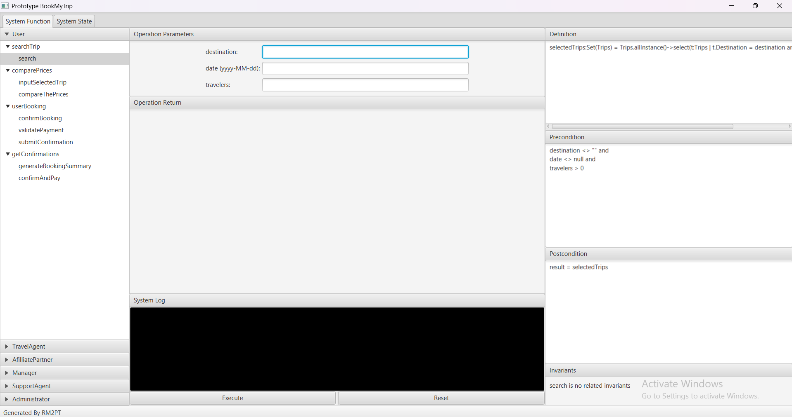
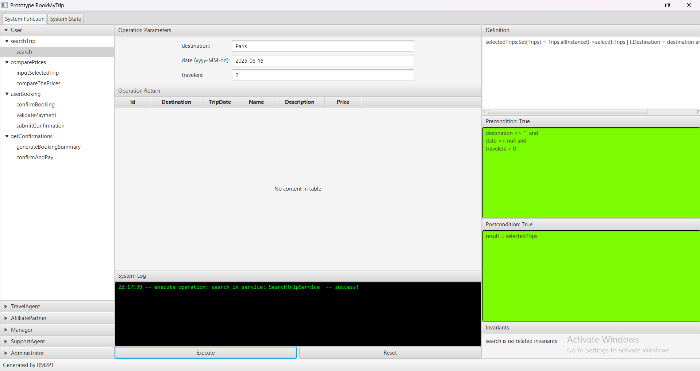
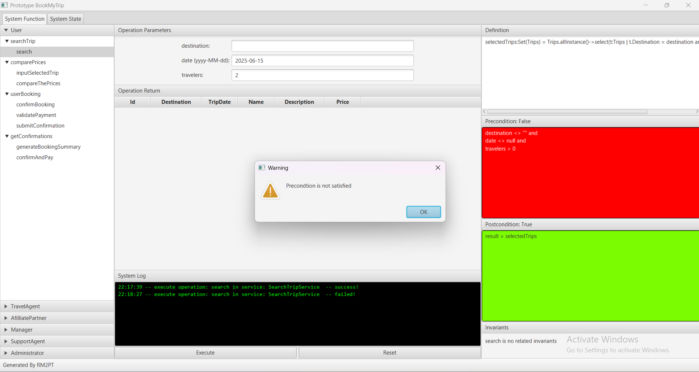

---

## 🌐 1. Use-Case Diagram



Actors & UC’s:

- **User**: searchTrip, comparePrices, userBooking, getConfirmations  
- **TravelAgent**, **AffiliatePartner**, **Manager**, **SupportAgent** with their own UCs  

---

## ✏️ 2. User Stories

  


Examples:

> **As a user**, I want to search for available trips so I can explore travel options.  
> **As an affiliate partner**, I want to promote offers and track referrals.  
> **As a system**, I want to integrate payment gateways, ensure uptime, and recover from failures.

---

## 📊 3. Domain Model



Key entities:

- **User**, **TravelPortal**, **Trips**, **Booking**, **Payment**, **PriceCompare**, **BookingSummary**, …  
- Associations and inheritance (e.g. TravelPortal → Payment, Booking → Trips)

---

## 🎞 4. Sequence Diagrams

1. **Search Trip**  
   

2. **Compare Prices**  
   

3. **User Booking**  
   

 ---
 
## 📐 5. Service Contracts (OCL)

### a) `SearchTripService::search(...)`

```ocl
Contract SearchTripService::search(
    destination:String,
    date:Date,
    travelers:Integer
) : Set(Trips) {
  definition:
    selectedTrips:Set(Trips) =
      Trips.allInstance()
           ->select(t | t.Destination = destination
                     and t.TripDate = date)
  precondition:
    destination <> "" and
    date <> null      and
    travelers > 0
  postcondition:
    result = selectedTrips
}
``` 
---


## 🛡️ 6. Validation

1. **Initial State**  
     
   At startup, all input fields are empty, no trips are listed, and the precondition panel shows green (`true`), since by default `destination <> "" and date <> null and travelers > 0` isn’t yet evaluated.

2. **Valid Input**  
     
   When you enter a non-empty destination, a valid date, and a positive traveler count, the search operation runs successfully: the precondition and postcondition panels stay green and the matching trips (if any) would appear in the table.

3. **Invalid Input**  
     
   If any input fails the precondition (e.g. empty destination), the precondition panel turns red and a warning dialog pops up (“Precondition is not satisfied”), preventing the operation from executing.

